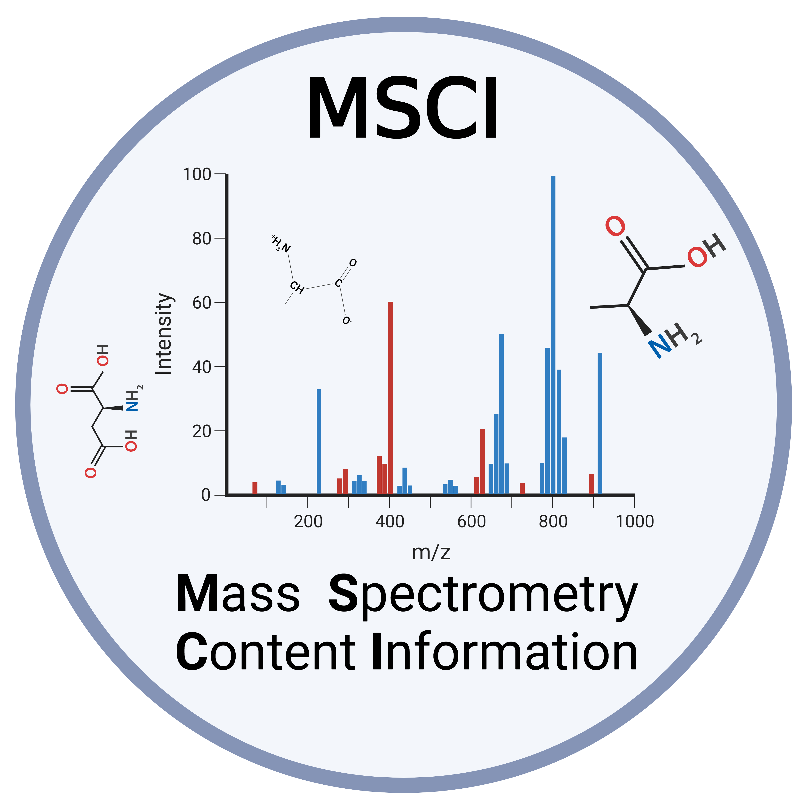

   

      
   

* Official Documentation available at: https://msci.readthedocs.io.

Peptide identification by mass spectrometry relies on the interpretation of fragmentation spectra based on the m/z pattern, relative intensities, and retention time (RT). Given a proteome, we wondered how many peptides generate very similar fragmentation spectra with current MS methods. MSCI is a Python package built to assess the information content of peptide fragmentation spectra, we aimed calculating an information-content index for all peptides in a given proteome would enable us to design data acquisition and data analysis strategies that generate and prioritize the most informative fragment ions to be queried for peptide quantification.

  

      
   

Installation:
==================
prerequisites:

- Python 3.8 -3.11
- Matchms

Implementation and example :
==================

**Open the Notebook**: Click on the following [link to Google Colab](https://colab.research.google.com/drive/1ny97RNgvnpD7ZrHW8TTRXWCAQvIcavkk?usp=sharing) 

Contribution
==================

If you would like to contribute to this project, feel free to fork the repository on GitHub and submit a pull request.
