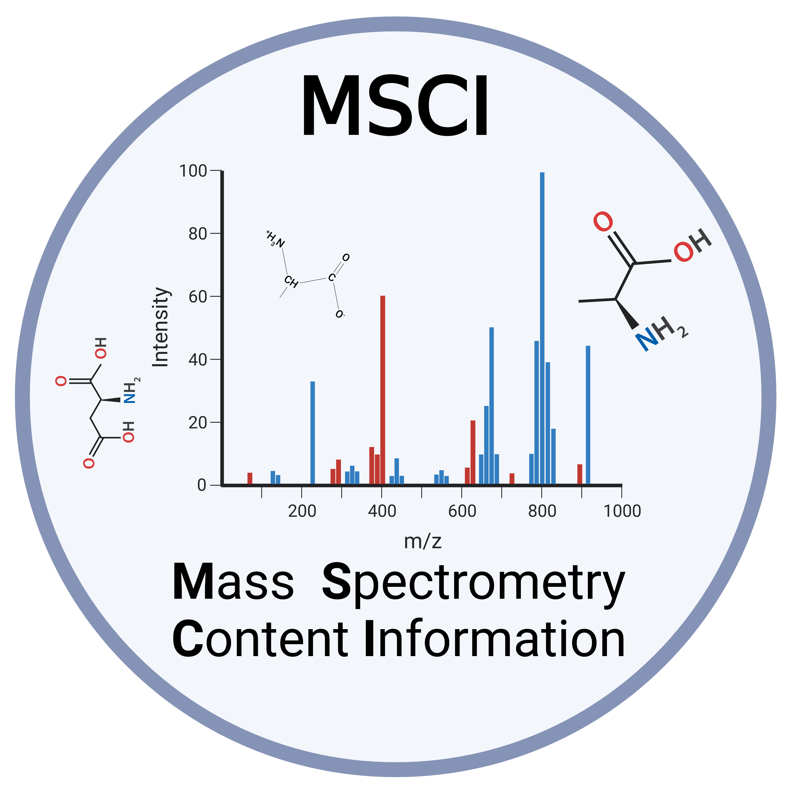

.. image:: https://img.shields.io/pypi/v/msci.svg
        :target: https://pypi.python.org/pypi/msci

* Free software: MIT license
* Official Documentation available at: https://msci.readthedocs.io.

Peptide identification by mass spectrometry relies on the interpretation of fragmentation spectra based on the m/z pattern, relative intensities, and retention time (RT). Given a proteome, we wondered how many peptides generate very similar fragmentation spectra with current MS methods. MSCI is a Python package built to assess the information content of peptide fragmentation spectra, we aimed calculating an information-content index for all peptides in a given proteome would enable us to design data acquisition and data analysis strategies that generate and prioritize the most informative fragment ions to be queried for peptide quantification.

.. image:: docs/INTRODUCTION.png
  :alt: matchms workflow illustration

Installation:
==================
prerequisites:

- Python 3.8 -3.11
- Anaconda
- Matchms

Example:
==================
Here is a small example of using MSCI to calculate pairwise normalized spectral angle 
.. testcode::

   from MSCI.Data.preprocessing import read_msp_file
   from MSCI.Grouping_MS1 import MassContentInformation, get_pair
   from MSCI.similarity.Similarity import  process_combin

   File= '.msp'
   mz_irt_df = read_msp_file(File)
   g = Grouping_mw_irt(mz_irt_df)
   group = g.group_sequences(1,10, unit='Da')
   group = np.array(group, dtype=object)
   combin = process_data(group)
   np.save("MSCA_Package/Tryptic_peptides/Dataset/combin/charge2_3_Low_Resolution.npy", combin)
   # Create a partial function of process_combin with relevant_spectra and other parameters
   process_combin_partial = partial(process_combin, spectra=relevant_spectra, tolerance=1, ppm=0)
  # Process the data sequentially
  results = [process_combin_partial(pair) for pair in updated_combin_chunk]
  # Save the results
  np.save(f'MSCA_Package/IMMUNO/output/HRLR_mutated_IMMUNO_spectra_angles_{subcombin_num}.npy', results)

Should output 
a list of peptides and their spectral angles
Installation
------------

You can install *mass_content_information* via pip_ from PyPI_:

.. code:: console

   $ pip install mass_content_information

Usage
-----

After installation, you can use the package by importing it in your Python code:

.. code:: console

    import mass_content_information

Then, you can use the calculate_similarity() function to calculate the similarity score of an MSP file:

.. code:: console

    mass_content_information.similarity('path_to_pairs')

The function takes the path to the MSP file as input and returns a list of tuples, where each tuple contains the pair of spectra within the MS1 and MS2 tolerance along with their SA.

The package also includes the intermediate features such as reading the MSP file, filtering spectra, grouping spectra within a tolerance range, and post-processing the similarity scores of each pair.

Contribution
-----

If you would like to contribute to this project, feel free to fork the repository on GitHub and submit a pull request.

Credits
-------
.. _Cookiecutter: https://github.com/audreyr/cookiecutter
.. _`audreyr/cookiecutter-pypackage`: https://github.com/audreyr/cookiecutter-pypackage
