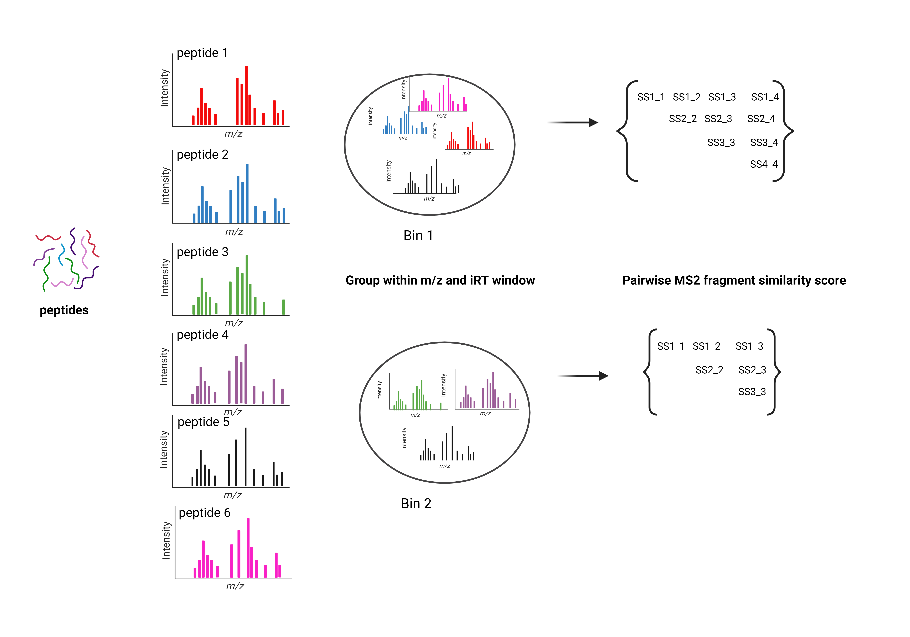

.. MSCI documentation master file, created by
   sphinx-quickstart on Sun Dec 24 14:38:13 2023.
   You can adapt this file completely to your liking, but it should at least
   contain the root `toctree` directive.

MSCI : Mass Spectrometry Content Information python Library
================================
.. toctree::
   :hidden:
   :maxdepth: 2
   :caption: Contents: 
   
   API

Peptide identification by mass spectrometry relies on the interpretation of fragmentation spectra based on the m/z pattern, relative intensities, and retention time (RT). Given a proteome, we wondered how many peptides generate very similar fragmentation spectra with current MS methods. *MSCI*  is a Python package built to assess the information content of peptide fragmentation spectra, we aimed to calculate an information-content index for all peptides in a given proteome that would enable us to design data acquisition and data analysis strategies that generate and prioritize the most informative fragment ions to be queried for peptide quantification.

Installation
==================
prerequisites:

- Python 3.8 -3.11
- Anaconda
- Matchms

Example
==================
Here is a small example of using MSCI to calculate the pairwise normalized spectral angle 
.. testcode::

   from MSCI.Preprocessing_data import read_msp_file
   from MSCI.grouping.groups import MassContentInformation, process_data
   from MSCI.similarity.Similarity import  joinPeaks, nspectraangle
   from MSCI.utils import process_combin, parallel_function
   import numpy as np 
   import multiprocessing as mp
   from functools import partial
   from multiprocessing import Pool, cpu_count
   File= 'MSCA_Package/Tryptic_peptides/Dataset/msp_files/charge2_3myPrositLib.msp'
   mz_irt_df = read_msp_file(File)
   g = MassContentInformation(mz_irt_df)
   group = g.group_sequences(1,10, unit='Da')
   group = np.array(group, dtype=object)
   combin = process_data(group)
    # Create a partial function of process_combin with relevant_spectra and other parameters
    process_combin_partial = partial(process_combin, spectra=relevant_spectra, tolerance=1, ppm=0)
    # Determine the number of CPU cores available
    num_cores = cpu_count()
    # Use a Pool to parallelize the processing
    with Pool(num_cores) as pool:
        results = pool.map(parallel_function, updated_combin_chunk)

    np.save(f'MSCA_Package/mutation/output/28CE/LRLRmutation_spectra_angles_ch2_3.npy', results)

Should output 
a dataframe 

Indices and tables
==================

* :ref:`genindex`
* :ref:`modindex`
* :ref:`geindex`
