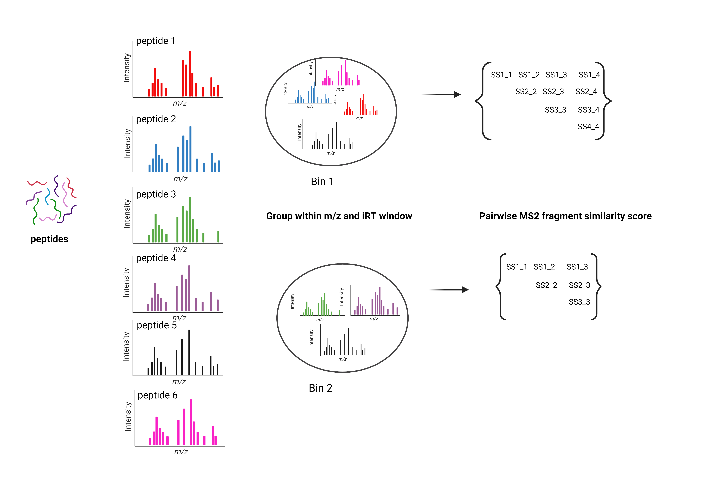

.. MSCI documentation master file, created by
   sphinx-quickstart on Sun Dec 24 14:38:13 2023.
   You can adapt this file completely to your liking, but it should at least
   contain the root `toctree` directive.

Welcome to MSCI's documentation!
================================
.. image:: https://github.com/zahrael97/MSCI/blob/master/docs/MSCI_logo.png
   :align: center
   :width: 300
   :height: 300

.. toctree::
   :maxdepth: 3
   :caption: Contents:
   
   API

Introduction:
==================
Peptide identification by mass spectrometry relies on the interpretation of fragmentation spectra based on the m/z pattern, relative intensities, and retention time (RT). Given a proteome, we wondered how many peptides generate very similar fragmentation spectra with current MS methods. *MSCI*  is a python package built to assess the information content of peptide fragmentation spectra, we aimed calculating an information-content index for all peptides in a given proteome would enable us to design data acquisition and data analysis strategies that generate and prioritize the most informative fragment ions to be queried for peptide quantification.

Installation:
==================
prerequisites:

- Python 3.8 -3.11
- Anaconda
- Matchms

Example:
==================
Here is a small example of using MSCI to calculate pairwise normalized spectral angle 
.. testcode::

   from MSCI.Data.preprocessing_data import read_msp_file
   from MSCI.grouping.groups import MassContentInformation, process_data
   from MSCI.similarity.Similarity import  process_combin
   File= 'MSCA_Package/Tryptic_peptides/Dataset/msp_files/charge2_3myPrositLib.msp'
   #spectra = list(load_from_msp(File))
   #pickle.dump(spectra, open('MSCA_Package/Tryptic_peptides/Dataset/msp_files charge2_3myPrositLib.pkl', 'wb'))
   mz_irt_df = read_msp_file(File)
   g = MassContentInformation(mz_irt_df)
   group = g.group_sequences(1,10, unit='Da')
   group = np.array(group, dtype=object)
   combin = process_data(group)
   np.save("MSCA_Package/Tryptic_peptides/Dataset/combin/charge2_3_LR.npy", combin)

Should output 

Indices and tables
==================

* :ref:`genindex`
* :ref:`modindex`
* :ref:`geindex`
